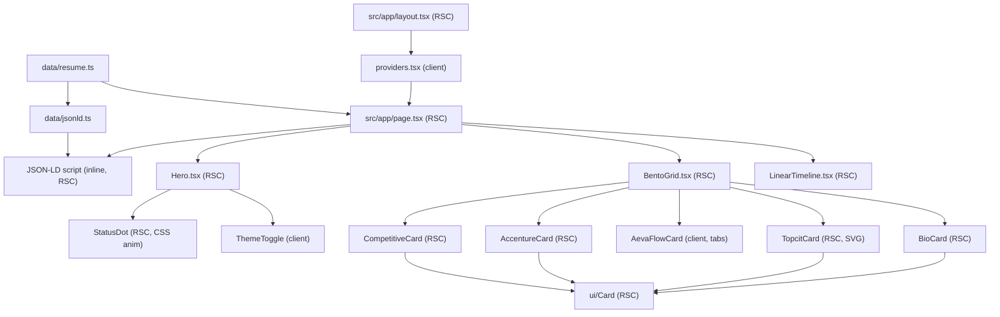

# System-Architecture Bento Portfolio — Implementation Plan

## 0. Pre-flight findings (current state)

- App currently lives at root `app/` (not `src/`). `tsconfig.json` maps `@/* → ./*`. Migrating to a `src/` layout requires moving `app/` into `src/app/` and changing the alias to `./src/*`.
- `next-themes` is **not installed**. It is the only runtime dependency to add.
- `public/Resume_Christian_Derek_Amplayo.pdf` does **not exist yet** — you must drop the PDF into `public/` before the download CTA resolves.
- Stack confirmed: `next@16.2.9`, `react@19`, `tailwindcss@4` via `@tailwindcss/postcss`, Geist + Geist Mono already wired through `next/font/google`.

### Assumptions (stated, not blocking)
- Keep Geist (sans) + Geist Mono (mono accents) — already configured, fits the console aesthetic.
- Single typed data source `src/data/resume.ts` feeds every card (keeps RSCs clean, JSON-LD in sync).
- A `SITE_URL` constant (placeholder, e.g. `https://christianderek.dev`) drives `metadataBase` and JSON-LD `url`/`sameAs`. Swap in the real domain later.
- Bento breakpoints follow your spec `grid-cols-1 md:grid-cols-3`, with an optional `sm:grid-cols-2` tablet tier noted below.

---

## 1. Directory Outline (files to create / modify / move)

### Move + modify
- `app/layout.tsx` → `src/app/layout.tsx` (rewrite: fonts, metadata, providers, `suppressHydrationWarning`)
- `app/page.tsx` → `src/app/page.tsx` (rewrite: RSC composition + JSON-LD)
- `app/globals.css` → `src/app/globals.css` (rewrite: Tailwind v4 tokens + dark custom-variant)

### Create
- `src/app/providers.tsx` — `"use client"` next-themes wrapper
- `src/components/Hero.tsx` — RSC
- `src/components/ThemeToggle.tsx` — `"use client"`
- `src/components/BentoGrid.tsx` — RSC (grid shell)
- `src/components/ui/Card.tsx` — RSC (shared console card shell)
- `src/components/ui/StatusDot.tsx` — RSC (CSS-animated emerald dot)
- `src/components/cards/BioCard.tsx` — RSC (Card 1)
- `src/components/cards/TopcitCard.tsx` — RSC (Card 2, SVG meters)
- `src/components/cards/AevaFlowCard.tsx` — `"use client"` (Card 3, tabs)
- `src/components/cards/AccentureCard.tsx` — RSC (Card 4)
- `src/components/cards/CompetitiveCard.tsx` — RSC (Card 5)
- `src/components/LinearTimeline.tsx` — RSC
- `src/data/resume.ts` — typed single source of truth
- `src/data/jsonld.ts` — builds Person/ProfilePage schema from `resume.ts`

### Modify (config)
- `package.json` — add `next-themes` (and optional dev `schema-dts` for typed JSON-LD)
- `tsconfig.json` — change `paths` `"@/*": ["./*"]` → `"@/*": ["./src/*"]`
- `public/` — add `Resume_Christian_Derek_Amplayo.pdf` (user-provided asset)



---

## 2. Component Architecture (Client vs Server)

Default everything to a Server Component. Only three islands are `"use client"`:

- `providers.tsx` — needs React context for `next-themes`.
- `ThemeToggle.tsx` — uses `useTheme()` + `useState` for mounted-guard.
- `cards/AevaFlowCard.tsx` — uses `useState` for the tab/toggle.

Everything else (`Hero`, `BentoGrid`, `BioCard`, `TopcitCard`, `AccentureCard`, `CompetitiveCard`, `LinearTimeline`, `ui/Card`, `ui/StatusDot`) is a **pure RSC**. Rationale and zero-layout-shift notes:

- The emerald "system-status" blinking dot is a **pure CSS keyframe animation**, so `StatusDot` stays an RSC (no JS needed for the pulse).
- `AevaFlowCard` is a client component, but it server-renders with its `defaultTab`, so the first paint already shows correct content — **no layout shift** on hydration.
- `ThemeToggle` renders a stable-size button immediately; the icon swap is gated behind a `mounted` flag to avoid a hydration mismatch without changing layout dimensions.

---

## 3. Theming + FOUC strategy (next-themes × Tailwind v4)

### Layout wiring (`src/app/layout.tsx`, RSC)
- `<html lang="en" suppressHydrationWarning className={\`${geistSans.variable} ${geistMono.variable}\`}>` — `suppressHydrationWarning` is required because next-themes mutates the class list pre-hydration.
- Body wraps children in `<Providers>`.
- `export const metadata` (+ `metadataBase: new URL(SITE_URL)`): title, description, `openGraph`, `authors`, `keywords`.

### Providers (`src/app/providers.tsx`, client)
```tsx
"use client";
import { ThemeProvider } from "next-themes";
export function Providers({ children }: { children: React.ReactNode }) {
  return (
    <ThemeProvider attribute="class" defaultTheme="system" enableSystem disableTransitionOnChange>
      {children}
    </ThemeProvider>
  );
}
```
- `attribute="class"` → toggles `.dark` on `<html>`. next-themes injects a synchronous inline `<head>` script that sets the class **before first paint** — this is the same pre-paint technique the Next.js "preventing flash before hydration" guide prescribes, so there is no FOUC and no flash of the wrong theme.
- `enableSystem` + `defaultTheme="system"` satisfies the system-theme requirement; `disableTransitionOnChange` prevents a color-transition smear when the user manually flips themes.

### `src/app/globals.css` (Tailwind v4)
```css
@import "tailwindcss";

/* Make dark: utilities respond to next-themes' .dark class */
@custom-variant dark (&:where(.dark, .dark *));

:root {
  --background: #fafafa;   /* zinc-50  */
  --foreground: #18181b;   /* zinc-900 */
  --border: #e4e4e7;       /* zinc-200 */
  --accent: #10b981;       /* emerald-500 */
}
.dark {
  --background: #09090b;   /* zinc-950 */
  --foreground: #e4e4e7;   /* zinc-200 */
  --border: #27272a;       /* zinc-800 */
  --accent: #34d399;       /* emerald-400 */
}

@theme inline {
  --color-background: var(--background);
  --color-foreground: var(--foreground);
  --color-border: var(--border);
  --color-accent: var(--accent);
  --font-sans: var(--font-geist-sans);
  --font-mono: var(--font-geist-mono);
}
```
- Console borders: a reusable `border border-border` (1px hairline) on the shared `ui/Card`, plus monospace labels via `font-mono`.
- Dark/light transition: a global `transition-colors` on body for ambient elements; `disableTransitionOnChange` suppresses it precisely during the toggle event.

---

## 4. Page composition + JSON-LD (`src/app/page.tsx`, RSC)

Structure: `<Hero />` → `<BentoGrid />` → `<LinearTimeline />`, with the JSON-LD `<script>` rendered at the top of the page subtree.

```tsx
import { personJsonLd } from "@/data/jsonld";
// ...
<script
  type="application/ld+json"
  dangerouslySetInnerHTML={{ __html: JSON.stringify(personJsonLd).replace(/</g, "\\u003c") }}
/>
```
- `data/jsonld.ts` returns a `Person` graph (optionally `@graph` with `ProfilePage`) including: `name`, `jobTitle`, `address` (Sta. Ana, Manila), `email`, `url`, `sameAs` (LinkedIn), `knowsAbout` (SAP ABAP, Node.js/TS, Prisma, Next.js, etc.), `alumniOf` (UST), and `hasCredential` → `EducationalOccupationalCredential` for **TOPCIT Level 3** carrying the 80.0% System Architecture and 89.5% IT Business & Ethics figures.
- `<` escaping prevents XSS injection from any string field, per the Next.js JSON-LD guide.

---

## 5. Bento grid responsiveness (`BentoGrid.tsx`, RSC)

Container: `grid grid-cols-1 md:grid-cols-3 gap-6`. Card spans via `md:col-span-*` / `md:row-span-*` so positions reflow cleanly across breakpoints.

### Desktop / Tablet (`md`, 3 columns)
- Card 1 Bio & Skills: `md:col-span-1 md:row-span-2` (tall left rail)
- Card 2 TOPCIT: `md:col-span-1`
- Card 4 Accenture: `md:col-span-1`
- Card 5 Competitive: `md:col-span-2`
- Card 3 AEVA (full width): `md:col-span-3`

Resulting desktop map:
- Row 1: `[ Bio ][ TOPCIT ][ Accenture ]`
- Row 2: `[ Bio (cont.) ][ Competitive — 2 wide ]`
- Row 3: `[ AEVA — full 3 wide ]`

### Mobile (`grid-cols-1`)
Every card becomes full-width and stacks in DOM/priority order: Bio → TOPCIT → AEVA → Accenture → Competitive. All spans collapse to a single column automatically.

### Optional tablet tier
If you want a distinct tablet layout, add `sm:grid-cols-2` (cards pair up before going 3-wide at `md`). Noted as an enhancement; default honors your `grid-cols-1 md:grid-cols-3` spec.

### Card contents
- **Card 1 Bio**: monospace-accented intro + skills chips (`font-mono` labels).
- **Card 2 TOPCIT**: two SVG **radial meters** (static `<circle>` with `stroke-dasharray`/`stroke-dashoffset` computed from 80.0% and 89.5%) — pure SVG, RSC, no JS.
- **Card 4 Accenture**: console module — DDIC config, ALV reports, ABAP Open SQL.
- **Card 5 Competitive**: Google CEB-I Hacks Top 25 + ICMFS UST research, 2-wide.

---

## 6. Interactive AEVA card (`cards/AevaFlowCard.tsx`, client)

- `"use client"` with `const [tab, setTab] = useState<"makecom" | "nodejs" | "pipeline">("pipeline")`.
- Accessible tablist: `role="tablist"`, each trigger `role="tab"` + `aria-selected` + `aria-controls`; panel `role="tabpanel"`. Active tab uses the emerald accent (`text-accent`, `border-accent`).
- Three views: **Make.com** (9 legacy blueprint blocks) → **Node.js/TS** (production server modules: Cliniko PMS, VAPI handlers, Postmark 13+ email types) → **Pipeline** (visual left→right migration arch diagram rendered with flex + SVG connectors).
- State is ephemeral (no `localStorage`), and the component SSRs with `defaultTab`, so there is no hydration mismatch and no layout shift. Keyboard support: arrow keys move between tabs.

---

## 7. Build order (sequencing once approved)

1. Install `next-themes`; migrate `app/` → `src/app/`; update `tsconfig.json` alias.
2. Rewrite `globals.css` (tokens + `@custom-variant dark`); add `providers.tsx`; rewrite `layout.tsx` (fonts, metadata, suppressHydrationWarning).
3. Add `data/resume.ts` + `data/jsonld.ts`.
4. Build `ui/Card` + `ui/StatusDot`, then `Hero` + `ThemeToggle`.
5. Build `BentoGrid` + the five cards (AEVA client island last).
6. Build `LinearTimeline`; wire `page.tsx` + JSON-LD.
7. Verify: `next build` clean, no hydration warnings, theme toggles without flash, Rich Results test passes, Lighthouse CLS ≈ 0.

### Verification criteria
- `npm run build` succeeds with zero hydration/type errors.
- Toggling theme (and OS system change) updates instantly with no FOUC on hard reload.
- AEVA tabs switch via mouse + keyboard, correct ARIA states.
- JSON-LD validates in Google Rich Results Test.
- Resume CTA downloads `Resume_Christian_Derek_Amplayo.pdf`.