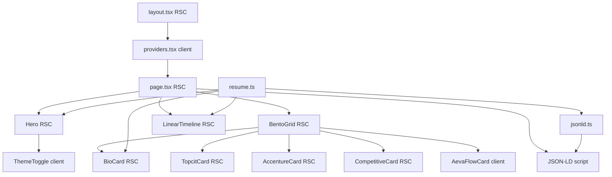

# Portfolio Architecture & Design Audit Report

## Executive Summary

The portfolio is a **single-page, server-first Next.js 16 App Router** site with a clear **System-Architecture Bento / Console Minimalist** identity: zinc neutrals, Geist + Geist Mono, emerald accents, and three intentional client islands (`Providers`, `ThemeToggle`, `AevaFlowCard`). Content is largely centralized in [`src/data/resume.ts`](src/data/resume.ts), with ProfilePage JSON-LD and solid FOUC-safe theming.

**Verdict:** Strong technical foundation and distinctive aesthetic. The main gaps are **recruiter scan path**, **incomplete content surfaces** (education, phone, GitHub, dedicated contact), **design-token underuse**, **hardcoded copy outside the data layer**, and **SEO/asset polish** (OG image, sitemap/robots, unused public SVGs). Improve the existing bento system — do not replace it.

---

## Current Tech Stack

| Layer | Choice |
|-------|--------|
| Framework | **Next.js 16.2.9** (App Router, Turbopack) |
| UI | **React 19.2.4** / **react-dom 19.2.4** |
| Language | **TypeScript 5** (`strict: true`) |
| Styling | **Tailwind CSS v4** via `@tailwindcss/postcss` |
| Theming | **next-themes ^0.4.6** (`attribute="class"`, `defaultTheme="system"`) |
| Fonts | **Geist** + **Geist Mono** (`next/font/google`) |
| Lint | ESLint 9 + `eslint-config-next` 16.2.9 |
| Deploy | Assumed **Vercel** (GitHub `main` → Production); empty [`next.config.ts`](next.config.ts) |

**Important libraries:** Only runtime deps are `next`, `react`, `react-dom`, `next-themes`. No UI kit, animation lib, or analytics.

**Path alias:** `@/*` → `./src/*` in [`tsconfig.json`](tsconfig.json).

---

## Current Architecture

### Folder & App Router

Uses **`src/app/`** (not root `app/`):

```
src/
  app/          layout, page, providers, globals.css, favicon
  components/   Hero, BentoGrid, LinearTimeline, ThemeToggle, cards/*, ui/*
  data/         resume.ts, jsonld.ts
public/         Resume PDF + leftover create-next-app SVGs
```

Single route: `/` ([`src/app/page.tsx`](src/app/page.tsx)). No API routes, middleware, sitemap, or robots.

### RSC vs Client



**Client islands (3):** theme provider, theme toggle, AEVA tabs. Everything else is RSC — correct and lean.

### Data & layout composition

- **Source of truth:** [`resumeData`](src/data/resume.ts) + `SITE_URL`
- **Page tree:** Hero → BentoGrid (5 cards) → LinearTimeline → footer
- **SEO:** Metadata in [`layout.tsx`](src/app/layout.tsx); ProfilePage/Person JSON-LD in [`jsonld.ts`](src/data/jsonld.ts) injected on page
- **Assets:** Resume PDF in `public/`; `file.svg` / `vercel.svg` / `window.svg` unused

### SEO / JSON-LD today

- Present: title, description, authors, keywords, Open Graph (title/description/url/type `profile`), ProfilePage + Person + credentials
- Missing: OG/Twitter images, `robots.ts`, `sitemap.ts`, explicit canonical, GitHub in `sameAs`

---

## Current Design System

### Tokens ([`globals.css`](src/app/globals.css))

| Token | Light | Dark |
|-------|-------|------|
| `--background` | `#fafafa` | `#09090b` |
| `--foreground` | `#18181b` | `#e4e4e7` |
| `--border` | `#e4e4e7` | `#27272a` |
| `--accent` | `#10b981` | `#34d399` |

`@custom-variant dark (&:where(.dark, .dark *))` correctly pairs with next-themes.

**Gap:** Components mostly hardcode `neutral-*` / `emerald-*` instead of `bg-background`, `text-foreground`, `border-border`, `text-accent`. Tokens exist but are underused.

### Typography & spacing

- Sans: Geist (headings, body)
- Mono: Geist Mono (labels, paths, badges, CTAs) — console identity
- Spacing: ad hoc Tailwind (`gap-4/6`, `p-6`, `space-y-20`, `max-w-6xl`) — consistent enough, not formalized
- Card shell: [`Card.tsx`](src/components/ui/Card.tsx) — border, blur, `rounded-xl`, `p-6`, hover border, optional `sys.*` label

### Bento layout ([`BentoGrid.tsx`](src/components/BentoGrid.tsx))

- `grid-cols-1 md:grid-cols-3 gap-6`
- Bio `row-span-2`; Competitive `col-span-2`; AEVA `col-span-3`
- No `sm:` intermediate breakpoint; mobile is a single stack

### CTAs & dark mode

- Primary CTA: emerald-tinted resume download in Hero
- Theme toggle: monospace `[ MODE: LIGHT|DARK ]` with CLS-safe skeleton
- Dark mode: class-based, FOUC-safe via `suppressHydrationWarning` + next-themes script

### Primitives

- Reused: `Card`, `StatusDot`, `ThemeToggle`
- Repeated inline: skill/tech badge classes, section heading styles, card title patterns

---

## Portfolio Content Structure

| Area | Status | Notes |
|------|--------|-------|
| Hero | Present | Name, `~/role`, status, contact row, PDF CTA, theme |
| Bio | Inside BioCard | Hardcoded paragraph (not in `resumeData`) |
| Skills | Inside BioCard | 4 categories as pills — dense in tall card |
| Experience | Timeline + Accenture card | Full bullets in timeline; Accenture duplicated in bento |
| Projects / case study | AEVA card only | Strong interactive story; Concisium/TMG underrepresented as “projects” |
| Certifications | TopcitCard | SVG radials — distinctive |
| Competitive / leadership | CompetitiveCard | Hackathon + ICMFS |
| Education | Data only | In `resumeData` + JSON-LD; **not rendered on page** |
| Contact | Partial | Email/LinkedIn/location in Hero; **phone unused**; no contact section |
| Resume download | Present | `/Resume_Christian_Derek_Amplayo.pdf` + `download` |

### Recruiter weaknesses

1. No clear **value proposition headline** beyond name + `~/software-engineer`
2. **Education** invisible on the page
3. **Phone / GitHub** not surfaced (GitHub optional and empty)
4. Skills buried inside a tall Bio card — hard to scan
5. Accenture appears in bento **and** timeline (redundancy)
6. AEVA narrative **hardcoded** — drifts from `resumeData`
7. No sticky/secondary CTA after the fold
8. Console labels (`sys.profile`) may confuse non-technical recruiters without clearer human titles

---

## Strengths

- Coherent console-bento visual language
- Correct RSC-first split; minimal client JS
- Typed, centralized resume data + JSON-LD
- FOUC-safe system theme
- Accessible AEVA tabs (ARIA + keyboard)
- Static prerender-friendly page
- Shared `Card` / `StatusDot` primitives
- Distinctive TOPCIT radial meters (no chart library)

---

## Weaknesses / Gaps

**Design / UX**

- Hero lacks one scannable positioning line (stack + open-to-work)
- Bento density uneven: Bio overloaded; Accenture overlaps timeline
- No tablet (`sm`) grid refinement
- Design tokens defined but bypassed by raw color utilities
- Card labels can collide with content (absolute top-right)

**Content**

- Education, phone, GitHub missing from UI
- Hardcoded bio / AEVA / Competitive prose
- Unused default SVGs in `public/`

**SEO / a11y / perf**

- No OG image, Twitter cards, sitemap, robots
- `SITE_URL` may not match live Vercel domain
- Decorative SVGs lack consistent labeling patterns elsewhere; focus rings not standardized
- `backdrop-blur` on every card is a minor paint cost
- Resume `download` attribute unreliable cross-browser (known)

**Maintainability**

- Duplicated badge / heading class strings
- `CompetitiveCard` uses `hackathons[0]` / `academicExperience[0]` — fragile
- No shared `cn()` helper; class merge is ad hoc
- Empty `next.config.ts`; README still create-next-app boilerplate

---

## Design Improvement Suggestions

Keep the console bento; polish hierarchy and scan path.

1. **Hero clarity** — Add one short positioning line under the path (e.g. “Backend & systems · Node.js/TS · SAP ABAP · Open to roles”). Keep status pill; make PDF CTA visually primary; add LinkedIn as secondary text link.
2. **Bento polish** — Prefer human titles + small `sys.*` labels; give Bio breathing room (summary + top skills only, or split skills); elevate AEVA as primary case study; demote or shorten Accenture card to avoid timeline duplication.
3. **Skills readability** — Compact grouped list or “featured skills” row; full list in Bio or a dedicated slim card.
4. **CTA placement** — Keep Hero download; add muted footer or timeline-end “Download CV / Email” strip.
5. **Mobile** — Reorder stack for recruiters: Hero → AEVA → Topcit → Competitive → Bio/skills → Accenture snippet → Timeline; tighten type scale; ensure tap targets ≥ 44px.
6. **Accessibility** — Visible focus rings on links/tabs/toggle; ensure status text isn’t color-only; verify contrast on emerald-on-tint CTAs.
7. **SEO** — Add `opengraph-image`, Twitter metadata, `sitemap.ts`, `robots.ts`; align `SITE_URL` with production domain; add GitHub to `sameAs` when available.
8. **Motion** — Keep StatusDot ping; optionally one restrained entrance on Hero/grid — avoid noise.

---

## Code Architecture Suggestions

1. **Move all copy into `resumeData`** — `summary`, AEVA case-study tabs, Competitive blurbs, resume file meta (`filename`, `sizeLabel`).
2. **Extract UI atoms** — `Badge`, `SectionHeading`, `MetaLine` to kill repeated Tailwind blobs.
3. **Keep client boundaries as-is** — Do not client-ify Hero/Bento/Timeline.
4. **Optional split** — `AevaFlowCard` shell (RSC) + `AevaTabs` (client) if the card grows.
5. **Safer lookups** — Find by `company` / `id` instead of `[0]`; add optional `id` on entities.
6. **Use semantic tokens** in `Card` and page shell (`bg-background`, `border-border`, `text-accent`).
7. **Add `cn()`** (tiny local helper or `clsx` + `tailwind-merge`) for `Card` className merging.
8. **Avoid overengineering** — No CMS, no route explosion, no component library. Stay data-file + RSC.

---

## Recommended Implementation Plan

### Quick wins (1–2 sessions)

- Surface **education** (compact card or timeline footnote)
- Add Hero **positioning sentence** from `resumeData.summary`
- Show **phone** (and GitHub if set) in Hero contact row
- Add `sitemap.ts` + `robots.ts`; basic OG image
- Remove unused `public/*.svg`
- Fix card label overlap (padding-top when label present)
- Align `SITE_URL` with real production domain

**Touch:** [`resume.ts`](src/data/resume.ts), [`Hero.tsx`](src/components/Hero.tsx), [`Card.tsx`](src/components/ui/Card.tsx), [`layout.tsx`](src/app/layout.tsx), new `src/app/sitemap.ts` / `robots.ts`, `public/`

### Medium improvements

- Data-drive AEVA + Competitive + Bio copy
- Extract `Badge` / shared meta styles
- Refine bento: featured skills; reduce Accenture duplication; optional `sm:` grid
- Footer secondary CTA
- Standardize focus-visible styles in `globals.css`

**Touch:** card components, [`BentoGrid.tsx`](src/components/BentoGrid.tsx), [`page.tsx`](src/app/page.tsx), [`globals.css`](src/app/globals.css)

### Larger (later)

- Split AEVA into RSC + client tabs
- Project case-study shape in data (AEVA first; TMG optional second)
- Lightweight motion for presence
- Content/README refresh; optional analytics

### What should not change

- Bento / console aesthetic (zinc + mono + emerald)
- RSC-first model and the three client islands’ purpose
- `resume.ts` as single content source (extend it, don’t replace with CMS)
- next-themes + `@custom-variant dark` FOUC approach
- Single-page portfolio structure (unless multi-route is explicitly requested later)
- TOPCIT SVG meters and AEVA tab concept (refine content/layout only)

---

## Files to Review or Modify

| Priority | File | Why |
|----------|------|-----|
| High | [`src/data/resume.ts`](src/data/resume.ts) | Add summary, caseStudy, education UI fields, resume meta |
| High | [`src/components/Hero.tsx`](src/components/Hero.tsx) | Positioning line, contact completeness, CTA hierarchy |
| High | [`src/components/BentoGrid.tsx`](src/components/BentoGrid.tsx) | Span/order polish for scan path |
| High | [`src/components/cards/BioCard.tsx`](src/components/cards/BioCard.tsx) | Data-driven summary; skills density |
| High | [`src/components/cards/AevaFlowCard.tsx`](src/components/cards/AevaFlowCard.tsx) | Move copy to data; keep client tabs |
| Medium | [`src/components/cards/CompetitiveCard.tsx`](src/components/cards/CompetitiveCard.tsx) | Data-driven blurbs; safer lookups |
| Medium | [`src/components/cards/AccentureCard.tsx`](src/components/cards/AccentureCard.tsx) | Shorten or differentiate from timeline |
| Medium | [`src/components/ui/Card.tsx`](src/components/ui/Card.tsx) | Token usage; label spacing |
| Medium | [`src/app/layout.tsx`](src/app/layout.tsx) | OG/Twitter metadata |
| Medium | [`src/app/globals.css`](src/app/globals.css) | Focus rings; encourage semantic colors |
| Medium | [`src/data/jsonld.ts`](src/data/jsonld.ts) | GitHub `sameAs`; keep in sync with UI |
| Low | [`src/components/LinearTimeline.tsx`](src/components/LinearTimeline.tsx) | Education footnote; end CTA |
| Low | [`src/app/page.tsx`](src/app/page.tsx) | Footer CTA; section order |
| Low | `public/` | Keep PDF; remove unused SVGs |
| New | `src/app/sitemap.ts`, `robots.ts`, OG image | SEO completeness |
| Avoid rewriting | [`providers.tsx`](src/app/providers.tsx), [`ThemeToggle.tsx`](src/components/ThemeToggle.tsx), [`StatusDot.tsx`](src/components/ui/StatusDot.tsx), [`TopcitCard.tsx`](src/components/cards/TopcitCard.tsx) radial math | Already solid — tweak only if needed |

---

## Suggested first implementation slice (after approval)

When you leave Plan mode and ask to implement, start with **Quick wins only**: `resumeData.summary` + Hero line, education surface, contact completeness, Card label padding, sitemap/robots, unused asset cleanup, `SITE_URL` check — without redesigning the bento grid.